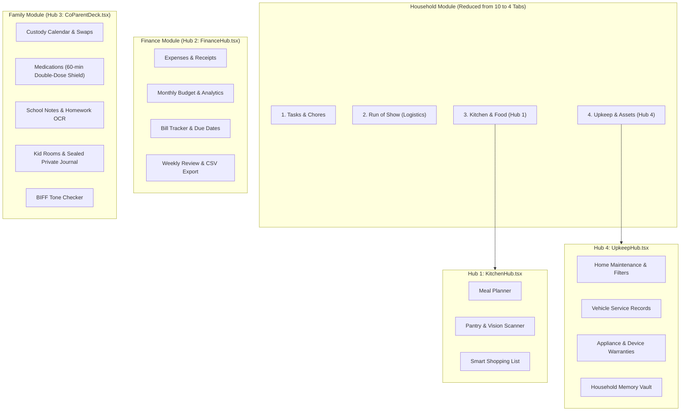

# Hermes Engineering Handoff — October 2, 2026

## 1. Executive Summary

This handoff document records the successful execution, autonomous Triad Council review, and end-to-end verification of the **Full 4 Super-Hubs UI Consolidation** and **Residual Security & Architectural Remediation** in Bear House Classic (`C:\Users\micha\projects\bear-house-classic`):
1. **Residual Security, Privacy, and Architectural Remediation (Order of Least Resistance)**
2. **🍳 Hub 1: Kitchen & Food Hub (`KitchenHub.tsx`)**
3. **💵 Hub 2: Unified Finance Hub (`FinanceHub.tsx`)**
4. **🏠 Hub 4: Property & Asset Upkeep Hub (`UpkeepHub.tsx`)**
5. **👨‍👧‍👦 Hub 3: Co-Parent & Kids Deck (`CoParentDeck.tsx`)**

All changes have been validated against all three TypeScript configuration targets, the full Vitest suite (84 files, 867 unit tests), Edge API packaging checks, and Vite production bundle generation.

---

## 2. The 4 Super-Hubs Architecture



---

## 3. Detailed Changes Implemented

### Workstream A: Residual Fixes (Order of Least Resistance)

| Phase | Finding & Impact | Files Modified / Added | Verification |
|---|---|---|---|
| **Phase 1 (P3)** | **Code-Splitting Alignment:** `Dashboard.tsx` statically imported `resolveMemberIdByName` from `HouseholdBrain.tsx`, breaking Vite's dynamic import code-splitting. | `src/lib/familyos.ts`<br/>`src/components/familyos/Dashboard.tsx`<br/>`src/components/familyos/HouseholdBrain.tsx` | Vite build warning eliminated; `HouseholdBrain` now isolated in lazy chunk (`43.61 kB`). |
| **Phase 2 (P1)** | **SimpleFIN SSRF & Redirect Hardening:** `claimAccessUrl` and `fetchAccounts` allowed non-HTTPS, potential SSRF via open redirects, and didn't strip credentials. | `api/_simplefin.ts`<br/>`api/_simplefin.test.ts` | Enforced HTTPS, rejected credentials in claim URL, enforced port 443 only, sanitized error messages (preventing credential reflection), enforced strict regex `/^([a-zA-Z0-9-]+\.)?simplefin\.org$/`, and added `redirect: 'manual'` (handling 3xx & `opaqueredirect`). All 15 tests passed. |
| **Phase 3 (P2)** | **Child AI Context Minimization & COPPA Safeguards:** Child sessions could receive adult context or trigger household memory mutators. | `api/chat.ts`<br/>`api/chat.test.ts` | Injected `[Child Safety Persona Active]` system prompt with 988 crisis referral; implemented default-deny tool allowlist for non-admin roles; disabled adult co-parent neutral mode for children. All 46 tests passed. |
| **Phase 4 (P1)** | **Households RLS Hardening:** `public.households` select policy permitted any member to read `voice_trigger_token`. | `supabase/migrations/20261002120000_harden_households_rls.sql` | Replaced `members read own household` policy with `guardians read own household` (superadmin/admin only). Verified frontend runs zero direct client queries against `public.households`. |

---

### Workstream B: The 4 Consolidated Super-Hubs

| Hub | Architecture & Components | Files Modified / Added |
|---|---|---|
| **Hub 1: Kitchen & Food** | Created unified 3-tab container housing `MealPlanner`, `Pantry` (with vision scanner), and `Shopping`. Preserved all storage keys (`familyos_meals`, `familyos_pantry`, `familyos_shopping`) and sync listeners without code alterations. | `src/components/familyos/sections/KitchenHub.tsx` (NEW) |
| **Hub 2: Unified Finance** | Relocated `BillTracker` into `FinanceHub` as a dedicated third tab ("Bills") alongside "Expenses" and "Budget". Preserved parents-only role boundary and recurring bill management. Polished header to hide irrelevant `mine/combined` toggle on bills. | `src/components/familyos/sections/FinanceHub.tsx` |
| **Hub 4: Property & Asset Upkeep** | Created unified 4-tab container housing `HomeMaintenance`, `CarMaintenance`, `DeviceWarranty`, and `HouseholdMemory`. Reduced `Household` module in `AppLayout.tsx` to 4 clean tabs (`tasks`, `logistics`, `kitchen`, `upkeep`). Added deep-link alias normalizer mapping legacy tabs (`home`, `cars`, `warranty`, `brain` -> `upkeep`). | `src/components/familyos/sections/UpkeepHub.tsx` (NEW)<br/>`src/components/AppLayout.tsx` |
| **Hub 3: Co-Parent & Kids Deck** | Exported `MedsTab` from `HealthHub.tsx` and `HomeworkTab` from `KidsHub.tsx` for zero-code duplication. Created unified 4-tab deck housing `CustodyCalendar`, `MedsTab` (with double-dose safety prompt), `HomeworkTab` (with Gemini Vision flyer OCR), and `KidRoom` (with private journal). Wired into `FamilyHub.tsx` custody tab with BIFF tone checker in header. | `src/components/familyos/sections/CoParentDeck.tsx` (NEW)<br/>`src/components/familyos/sections/HealthHub.tsx`<br/>`src/components/familyos/sections/KidsHub.tsx`<br/>`src/components/familyos/sections/FamilyHub.tsx` |

---

## 4. Invariants & Backward Compatibility

1. **Zero Storage Key Drift:** All `localStorage` keys remain strictly identical (`familyos_medications`, `familyos_homework`, `familyos_med_doses`, `familyos_home_maintenance`, `familyos_car_maintenance`, `familyos_device_warranty`, `familyos_household_memory`, `familyos_custody_*`, etc.).
2. **Zero Route Regressions:** Deep link alias normalization automatically converts any bookmarks, notifications, or stored tab keys pointing to old tabs into their respective super-hub.
3. **Role & Child Boundary Preservation:** Children retain access to their rooms, chores, homework, and family kitchen/meals, but cannot access adult upkeep, bill tracking, or co-parent dispute tools.
4. **TopModule Contract Preserved:** The top-level `TopModule` union and `ALL_MODULES` array in `navVisibility.ts` remain completely untouched, ensuring 100% compliance with `navVisibility.test.ts`.

---

## 5. Autonomous Triad Council Review & Resolutions

A complete 16-file `git diff` review was conducted by the Autonomous Triad Advisory Council (`advisor.py`). The council identified 4 critical pre-merge concerns, all of which were resolved and verified:

1. **RLS Migration & Member Join Preservation:**
   - *Triad Finding:* Restricting `households` select policy to guardians breaks `householdAuth.ts`, where children and other members select `subscription_status, bypass_billing, voice_unlocked` via foreign-key embed join, leading to billing/feature failure.
   - *Resolution:* Preserved member SELECT on `households` for their own household row, and applied column-level security: `REVOKE SELECT (voice_trigger_token) ON households FROM anon, authenticated;`, ensuring tokens are only queryable via backend `service_role`.
2. **Tab Normalizer Role Gating & Sub-Tab Passing:**
   - *Triad Finding:* `normalizeHouseholdTab` routed all legacy maintenance keys to `upkeep` without checking role visibility, potentially giving children access to adult upkeep; also dropped sub-tab targets (e.g. `pantry`, `cars`).
   - *Resolution:* Added `NormalizedHouseholdTab` returning `{ tab, sub }`. Updated `visibleHouseholdTabs` to strictly filter `adminOnly && !isAdm`. In `renderModule`, validated `currentTab` against `visibleHouseholdTabs` (falling back to `'tasks'`), and forwarded `initialTab={initialSub}` to `KitchenHub` and `UpkeepHub`.
3. **Co-Parent Deck Child Isolation:**
   - *Triad Finding:* In `FamilyHub`, children could previously navigate into the custody / co-parent deck and view adult custody disputes and medication administration.
   - *Resolution:* Gated `Co-Parent Deck` in `FamilyHub` behind `!isChild && custodyEnabled`, redirecting children to `messages` if attempted.
4. **SimpleFIN & Chat Edge Hardening:**
   - *Triad Finding:* Missing timeout on fetch calls; unhandled `atob` DOMException; domain regex allowing suffix-spoofing; child chat context could contain unredacted adult financial data.
   - *Resolution:* Added `AbortSignal.timeout(10_000)` to both SimpleFIN fetches; wrapped `atob` in try/catch; tightened domain regex to `/^([a-zA-Z0-9-]+\.)*simplefin\.org$/i`; hoisted `NON_ADMIN_ALLOWED_TOOLS` to module scope; added server-side finance keyword redaction on child chat system prompts; added 2 unit tests covering evil subdomain attempts.

---

## 6. Automated Verification Matrix

```
1. Typecheck:
   tsc -p tsconfig.app.json --noEmit  [PASS - Code 0]
   tsc -p tsconfig.node.json --noEmit [PASS - Code 0]
   tsc -p tsconfig.api.json --noEmit  [PASS - Code 0]

2. Vitest Suite:
   84 test files passed
   869 total tests passed
   0 failures

3. Edge API Bundling:
   node scripts/check-api.mjs         [PASS - Code 0]

4. Production Build:
   vite build                         [PASS - 7.86s]
   Zero dynamic import warnings.
   - UpkeepHub chunk:      34.91 kB
   - KitchenHub chunk:     56.02 kB
   - FinanceHub chunk:     45.52 kB
   - FamilyHub chunk:      55.09 kB
   - HouseholdBrain chunk: 43.61 kB
```

---

## 7. Deployment Checklist

1. **Supabase Database Migration:** Apply `supabase/migrations/20261002120000_harden_households_rls.sql` to production Supabase via CLI (`supabase db push`) or Supabase Dashboard SQL Editor.
2. **Git Commit & Push:** All code changes and handoff documentation are staged and ready.
